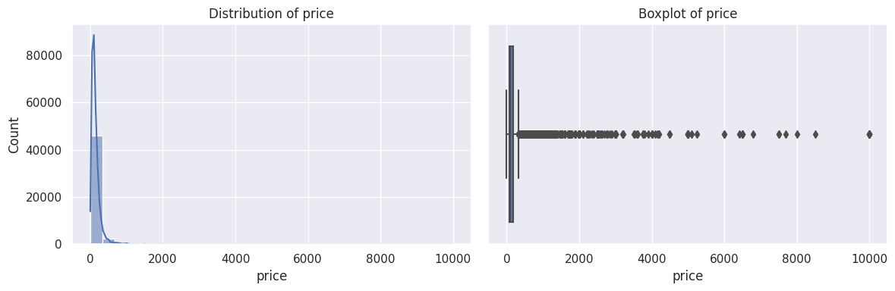
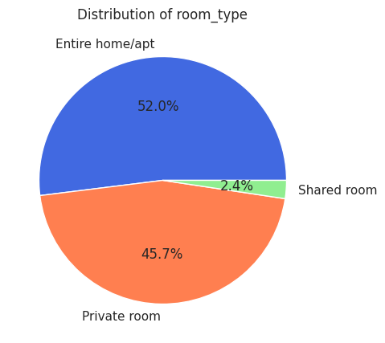
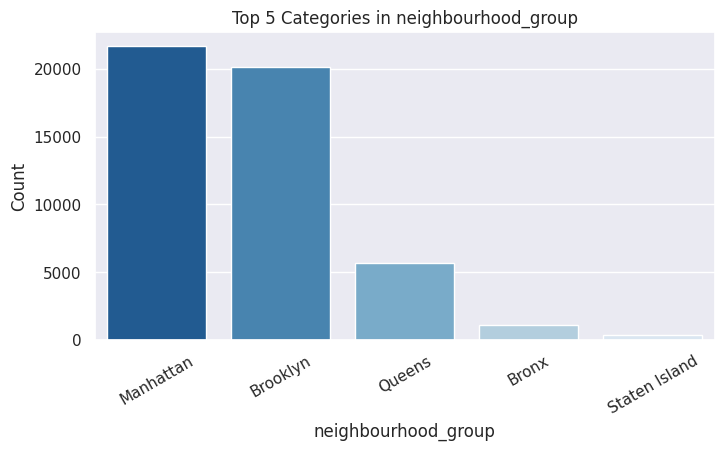
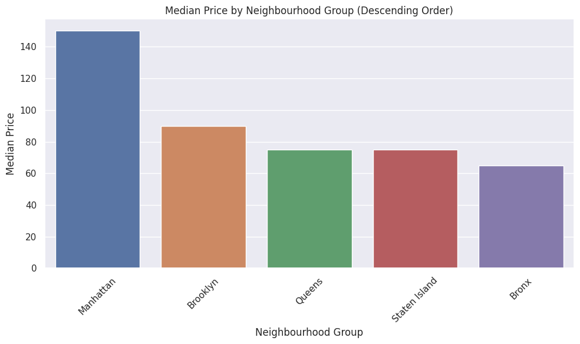
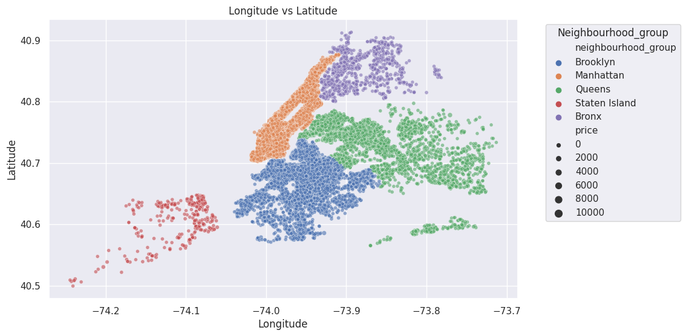

# NYC Airbnb 2019 Data Analysis

A data analysis project exploring New York City Airbnb listings using Python, Pandas, Seaborn, Matplotlib, Plotly, and ydata-profiling.

The project focuses on understanding listing prices, room types, neighbourhood groups, availability, reviews, missing values, and geographic listing distribution across NYC.

---

## Project Overview

This notebook analyzes the **New York City Airbnb Open Data 2019** dataset.  
The analysis includes data exploration, cleaning checks, statistical summaries, visualizations, and insights about Airbnb listings across different NYC neighbourhood groups.

The goal is to understand patterns such as:

- Which neighbourhood groups have higher median prices
- Which room types are most common
- How listing prices and availability are distributed
- Where listings are concentrated geographically
- How missing values and outliers appear in the dataset

---

## Dataset

The project uses the Kaggle dataset:

**New York City Airbnb Open Data**  
File used in the notebook:

```text
AB_NYC_2019.csv
```

The dataset is not included in this repository.  
Download it from Kaggle and place `AB_NYC_2019.csv` in the project root directory before running the notebook locally.

Expected local structure:

```text
NYC-Airbnb-2019-Data-Analysis/
│
├── nyairbnb_cleaned.ipynb
├── AB_NYC_2019.csv
├── requirements.txt
├── README.md
└── assets/
```

---

## Tools & Libraries

- Python
- Pandas
- NumPy
- Matplotlib
- Seaborn
- Plotly
- ydata-profiling
- Jupyter Notebook / Kaggle Notebook

---

## Main Workflow

### 1. Data Loading
The dataset is loaded from Kaggle or from a local CSV file if the notebook is run outside Kaggle.

### 2. Data Exploration
The notebook checks:

- Dataset shape and columns
- Data types
- Missing values
- Duplicate rows
- Descriptive statistics
- Number of unique values per column

### 3. Data Profiling
A profiling report is generated using `ydata-profiling` to summarize the dataset automatically.

### 4. Numerical Analysis
Numerical columns such as price, minimum nights, number of reviews, reviews per month, and availability are analyzed using histograms and boxplots.

### 5. Categorical Analysis
Categorical columns such as neighbourhood group, neighbourhood, and room type are visualized to understand the most common categories.

### 6. Price & Location Analysis
The project compares median prices by neighbourhood group and visualizes Airbnb listing locations using latitude and longitude.

---

## Project Outputs

### Price Distribution and Boxplot



### Room Type Distribution



### Neighbourhood Group Distribution



### Median Price by Neighbourhood Group



### Listing Map by Neighbourhood Group



---

## Key Insights

- Airbnb listings are not evenly distributed across neighbourhood groups.
- Manhattan shows the highest median listing prices compared to other neighbourhood groups.
- Entire home/apartment and private room are the most common room types.
- Price contains strong outliers, with very high maximum values compared to the median.
- Availability and review-related features are highly skewed.
- Geographic visualization shows listing concentration across different NYC areas.

---

## How to Run

1. Clone the repository:

```bash
git clone https://github.com/USERNAME/NYC-Airbnb-2019-Data-Analysis.git
cd NYC-Airbnb-2019-Data-Analysis
```

2. Install dependencies:

```bash
pip install -r requirements.txt
```

3. Download the dataset from Kaggle.

4. Place the file in the project folder:

```text
AB_NYC_2019.csv
```

5. Open the notebook:

```bash
jupyter notebook nyairbnb_cleaned.ipynb
```

---

## Repository Structure

```text
NYC-Airbnb-2019-Data-Analysis/
│
├── nyairbnb_cleaned.ipynb
├── README.md
├── requirements.txt
├── .gitignore
│
└── assets/
    ├── price-distribution-and-boxplot.png
    ├── room-type-distribution.png
    ├── neighbourhood-group-distribution.png
    ├── median-price-by-neighbourhood-group.png
    └── listing-map-by-neighbourhood-group.png
```

---

## Notes

- The original Kaggle notebook path is supported.
- For local execution, the notebook automatically looks for `AB_NYC_2019.csv` in the project root.
- The dataset file is excluded from GitHub to keep the repository clean.
- The notebook was cleaned before publishing by removing an incomplete code cell that could break `Run All`.

---

## Project Type

Exploratory Data Analysis (EDA) / Data Analytics Project
